Exploration of the Measured Me dataset
======================================

Data provided by [Measured Me](http://measuredme.com/). Thanks!

This worksheet was created in R Markdown. Markdown is a simple formatting syntax for authoring web pages. You can load up this worksheet in R Studio to run the examples directly and explore yourself!

## Metadata

A description of the dataset from the author, Konstantin:

1. Sleep duration and efficiency were tracked using Sleep Time app
2. Calorie expenditure, moderate and vigorous activity (in minutes), and steps were tracked using Bodymedia
3. Physical energy, stress, emotions positivity and intensity, happiness and life satisfaction were tracked using 10-point sliding scale in rTracker app.  
4. Physical Health was measured using 5-point scale (no symptoms= 5, ignorable symptoms = 4, distracting symptoms = 3, debilitating symptoms = 2, sickness = 1). 
5. The mental alertness was tracked using Mind Metrics app; I then converted the reaction time to Alertness score using formula 10000/alertness_time. 
6. The cognitive performance was tracked using Stroop Effect app. I converted time of responses to Cognitive score using formula 100/response_time.

## Load the data

Read in the csv file.

```r
mm <- read.csv("../measured_me.csv")
```


Let's take a look at the first few rows.

```r
head(mm)
```

```
##     Date Health Energy Stress MoodPos MoodInt Alertness Cognition Hap
## 1 May 27    3.7    7.3    2.4     7.6     5.6        34       9.4 6.8
## 2 May 28    4.0    6.5    4.2     5.5     5.3        34      10.1 4.9
## 3 May 29    4.0    6.2    4.1     7.2     6.0        34      10.1 7.0
## 4 May 30    3.8    7.7    2.4     6.5     5.8        36      10.2 5.5
## 5 May 31    4.0    5.8    3.2     6.5     5.6        33      10.2 6.4
## 6 June 1    3.8    6.3    2.7     7.3     4.5        31      10.9 7.2
##   LifeSat SlpTime SlpEff Calories ModAct VigAct Steps
## 1     7.4     497     91       NA     NA     NA    NA
## 2     6.2     476     95     2792    161      1 10827
## 3     7.0     476     88     3092    223      6 16992
## 4     6.0     481     77     3024    205      2 13492
## 5     6.8     451     88     3419    325      4 17663
## 6     7.0     380     96     3464    306      1 18840
```


It appears that the first column is a date, in an odd format.

```r
str(mm)
```

```
## 'data.frame':	147 obs. of  16 variables:
##  $ Date     : Factor w/ 147 levels "August 1","August 10",..: 93 94 95 96 97 63 74 85 87 88 ...
##  $ Health   : num  3.7 4 4 3.8 4 3.8 4 3.8 4 4 ...
##  $ Energy   : num  7.3 6.5 6.2 7.7 5.8 6.3 5.1 4.8 5.2 4.8 ...
##  $ Stress   : num  2.4 4.2 4.1 2.4 3.2 2.7 2.1 3.1 4 2 ...
##  $ MoodPos  : num  7.6 5.5 7.2 6.5 6.5 7.3 7.6 6.1 5.9 6.9 ...
##  $ MoodInt  : num  5.6 5.3 6 5.8 5.6 4.5 4.3 4.2 4.9 4.8 ...
##  $ Alertness: int  34 34 34 36 33 31 34 33 32 31 ...
##  $ Cognition: num  9.4 10.1 10.1 10.2 10.2 10.9 11.2 10.4 10.6 10.6 ...
##  $ Hap      : num  6.8 4.9 7 5.5 6.4 7.2 6.9 5.3 5 6.2 ...
##  $ LifeSat  : num  7.4 6.2 7 6 6.8 7 6.6 6.1 6.6 6.6 ...
##  $ SlpTime  : int  497 476 476 481 451 380 437 489 479 503 ...
##  $ SlpEff   : int  91 95 88 77 88 96 91 92 89 89 ...
##  $ Calories : int  NA 2792 3092 3024 3419 3464 3196 2871 3312 3170 ...
##  $ ModAct   : int  NA 161 223 205 325 306 220 179 263 238 ...
##  $ VigAct   : int  NA 1 6 2 4 1 0 5 10 1 ...
##  $ Steps    : int  NA 10827 16992 13492 17663 18840 17330 9466 13236 16856 ...
```


Yes, R isn't recognising it as a date. R thinks it's a categorical variable, or `factor`.

We can parse it so that R may convert it into the `Date` data type. There's a nice library to make this a bit easier. It also looks like the year is missing so we'll add that too.

```r
library(lubridate)
mm$Date <- parse_date_time(mm$Date, "md")
year(mm$Date) <- 2013
```


Then we can check to see if it worked.

```r
class(mm$Date)
```

```
## [1] "POSIXct" "POSIXt"
```

```r
summary(mm$Date)
```

```
##                  Min.               1st Qu.                Median 
## "2013-05-27 00:00:00" "2013-07-02 12:00:00" "2013-08-08 00:00:00" 
##                  Mean               3rd Qu.                  Max. 
## "2013-08-08 00:00:00" "2013-09-13 12:00:00" "2013-10-20 00:00:00"
```


Great. Looks like we're ready to get started.

##ggplot2
The excellent [GGplot2 library](http://docs.ggplot2.org/current/) implements the [Grammar of Graphics](http://www.springer.com/statistics/computational+statistics/book/978-0-387-24544-7).


```r
library(ggplot2)
```


Here is a basic example of a plot created by ggplot:


```r
ggplot(data = mm, aes(x = Date, y = Health)) + geom_point()
```

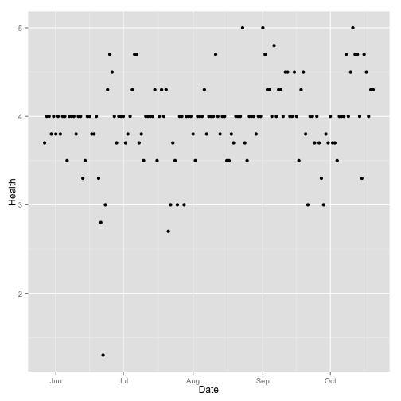 

We need to point out a few important things here:
1. ggplot requires that the data comes as a data frame. That's the first variable we give the function.
2. aes stands for aesthetics. It 'maps' the variables to different parts of the plot. Here we are saying we want the data on the x-axis and Health on the y-axis. 
3. We then tell ggplot how we want that relationship to be expressed graphically. Here we are just showing the data points. 

Let's try another type of plot.

```r
ggplot(data = mm, aes(x = Date, y = Health)) + geom_line()
```

 


That's a line plot. Point and line plots are two of the most important. It's still hard to make sense of the data though...


```r
ggplot(data = mm, aes(x = Date, y = Health)) + geom_smooth()
```

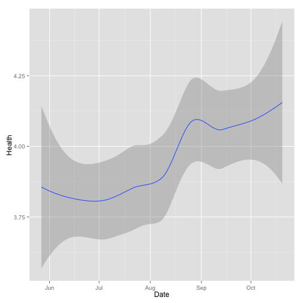 

Now, this is interesting! Now ggplot creates some kind of smoothing regression. It looks a lot like Konstatin's health improved over the course of last summer. 

We can also add several types of graphs. That's easy.


```r
ggplot(data = mm, aes(x = Date, y = Health)) + geom_point() + geom_smooth()
```

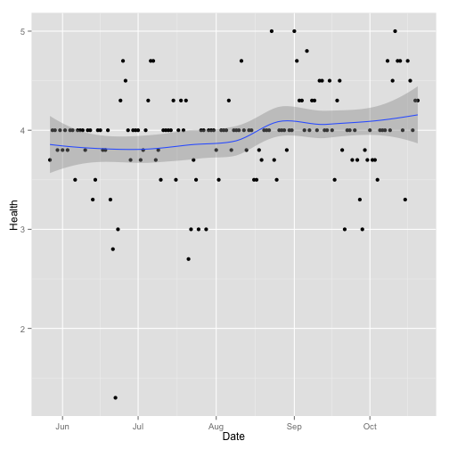 


There is an outlier in late June. Let's adjust the y-axis a bit. 


```r
library(scales)
ggplot(data = mm, aes(x = Date, y = Health)) + geom_point() + geom_smooth() + 
    scale_y_continuous(limits = c(3, 5))
```

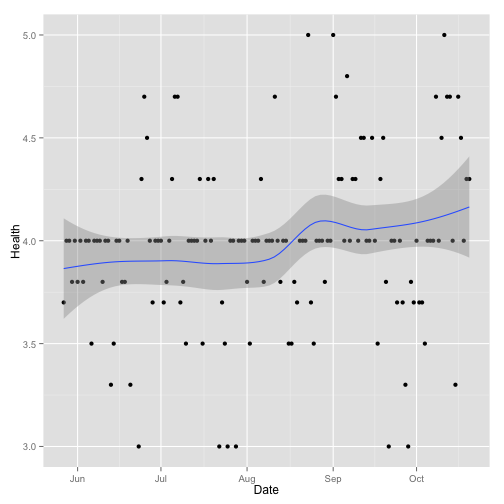 


Let's play a little bit more with ggplot here. We can make very big points and draw the line in red.

```r
ggplot(data = mm, aes(x = Date, y = Health)) + geom_point(size = 4) + geom_smooth(col = "red", 
    size = 3)
```

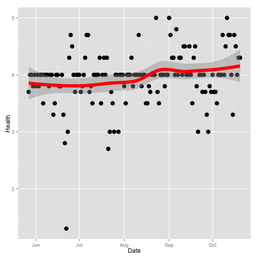 


Let's roll this back and try something different. There is a cool library with different graphics 'themes'. You can check out different examples on github: https://github.com/jrnold/ggthemes
We can try out a few. Here's one inspired by Edward Tufte.

```r
library(ggthemes)
ggplot(data = mm, aes(x = Date, y = Health)) + geom_point() + geom_smooth() + 
    theme_tufte()
```

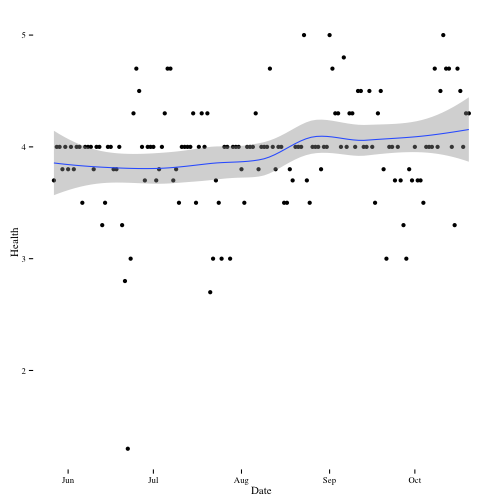 


Here is one called solarized.

```r
ggplot(data = mm, aes(x = Date, y = Health)) + geom_point() + geom_smooth() + 
    theme_solarized()
```

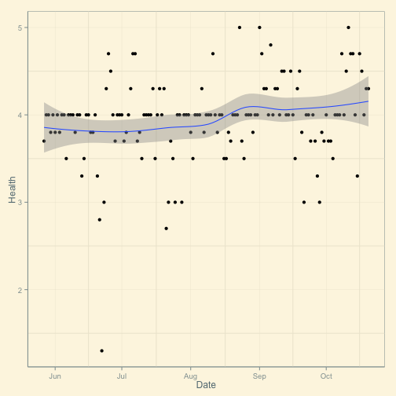 


A classic ugly one inspired by excel.

```r
ggplot(data = mm, aes(x = Date, y = Health)) + geom_point() + geom_smooth() + 
    theme_excel()
```

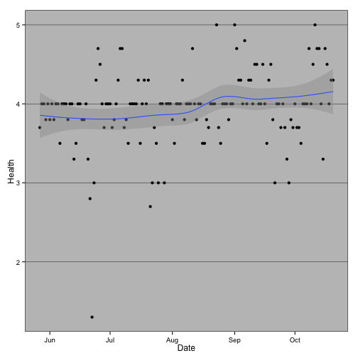 


Here is one inspired by the Economist.

```r
ggplot(data = mm, aes(x = Date, y = Health)) + geom_point() + geom_smooth() + 
    theme_economist()
```

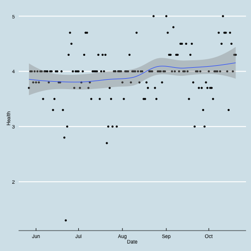 


Let's add a title to this graph. As you can see the cool thing with ggplot is that you can just add additional things to the graph without having to change the previous work.

```r
ggplot(data = mm, aes(x = Date, y = Health)) + geom_point() + geom_smooth() + 
    theme_economist() + ggtitle("Konstantin's Health")
```

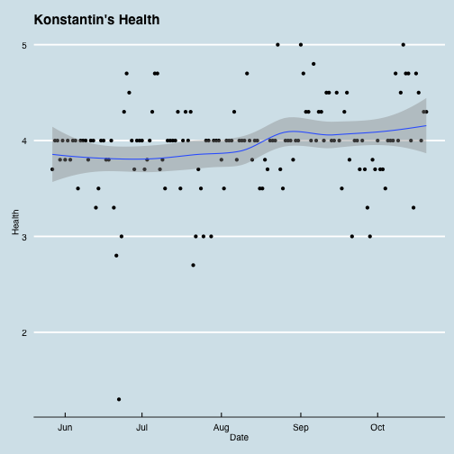 


But before we continue making nice graphs, let's take a step back and look at the data more systematically!

## Exploratory Visualisations
We can have a look at all the variable trends over the duration of the data.


```r
for (var in colnames(mm)[2:ncol(mm)]) {
    print(qplot(Date, mm[, var], data = mm, geom = "path", ylab = var))
    key <- readline("Press <return> for next plot")
    if (key != "") {
        break
    }
}
```

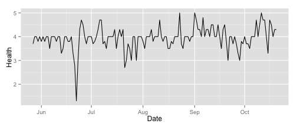 

```
## Press <return> for next plot
```

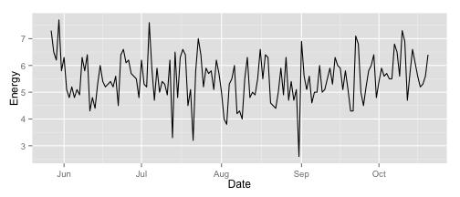 

```
## Press <return> for next plot
```

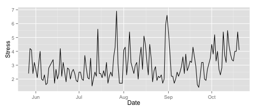 

```
## Press <return> for next plot
```

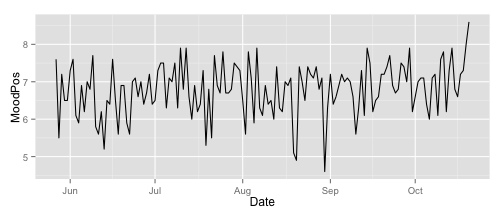 

```
## Press <return> for next plot
```

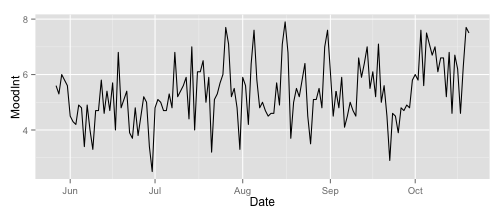 

```
## Press <return> for next plot
```

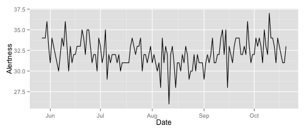 

```
## Press <return> for next plot
```

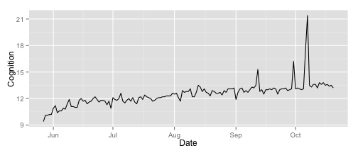 

```
## Press <return> for next plot
```

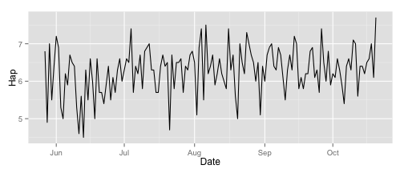 

```
## Press <return> for next plot
```

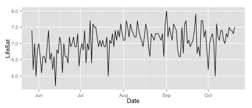 

```
## Press <return> for next plot
```

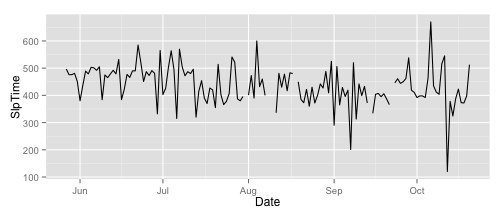 

```
## Press <return> for next plot
```

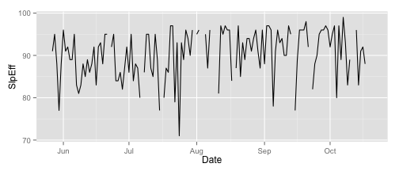 

```
## Press <return> for next plot
```

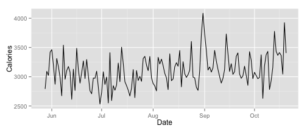 

```
## Press <return> for next plot
```

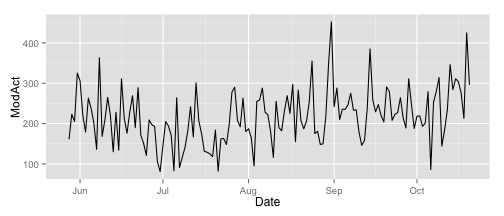 

```
## Press <return> for next plot
```

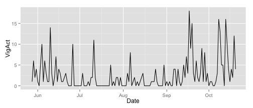 

```
## Press <return> for next plot
```

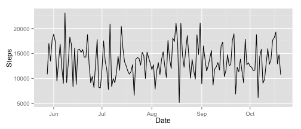 

```
## Press <return> for next plot
```


To plot these trends on the same chart we must first [normalise the data](http://en.wikipedia.org/wiki/Database_normalization). The `reshape2` library provides the `melt` function for this purpose.


```r
library(reshape2)
mm.melted <- melt(mm, id.vars = "Date")
head(mm.melted)
```

```
##         Date variable value
## 1 2013-05-27   Health   3.7
## 2 2013-05-28   Health   4.0
## 3 2013-05-29   Health   4.0
## 4 2013-05-30   Health   3.8
## 5 2013-05-31   Health   4.0
## 6 2013-06-01   Health   3.8
```


```r
ggplot(mm.melted, aes(Date, value)) + geom_path(na.rm = T) + geom_smooth(method = "loess", 
    na.rm = T) + facet_wrap(~variable, ncol = 1, scales = "free_y")
```

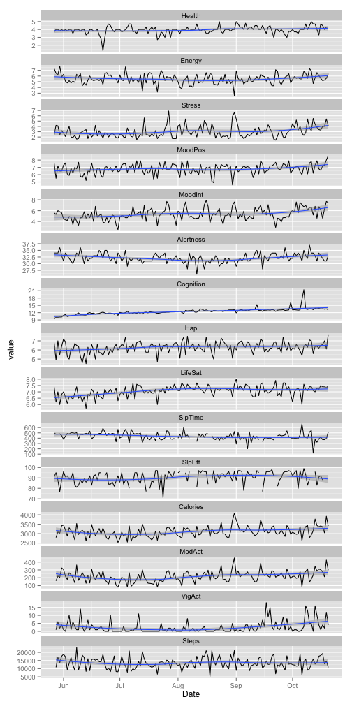 


Let's redo these graphs but without the path. Just the smooth regression line. Perhaps we'll see more then. (We just get rid of the geom_path for that.)

```r
ggplot(mm.melted, aes(Date, value)) + geom_smooth(method = "loess", na.rm = T) + 
    facet_wrap(~variable, ncol = 1, scales = "free_y")
```

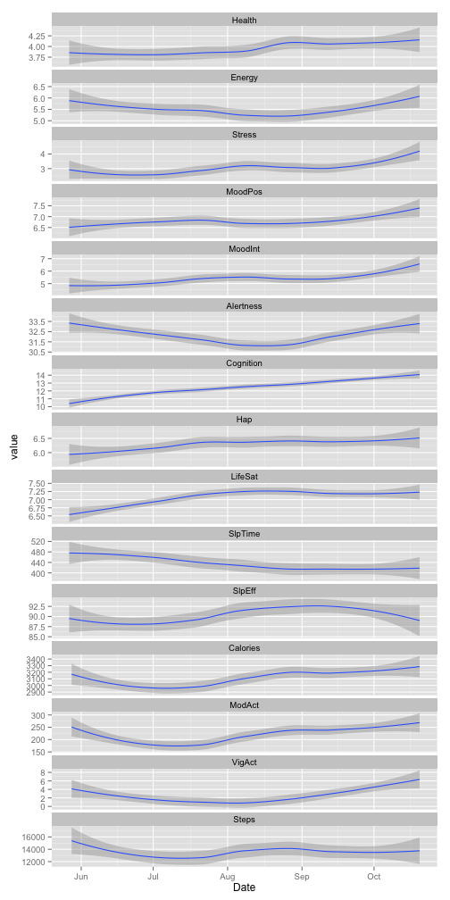 


It seems like Konstantin improved on many fronts. His health increased, positive mood increased, cognition increased (perhaps a training effect), happiness, life satisfaction increased too. 
Alertness took a bit of a slump in August and then got better again. 
What's also interesting is that his stress level increased and his sleep duration increased (although it became more efficient too). 

He also became significantly more physically active. One can see that steps, vigorous activity, moderate activity and calories burned are all highly correlated. They're all measured by the Bodymedia device. 

Does someone have experiences with a Bodymedia?

We can create bivariate plots to investigate the relationships between variables.

```r
ggplot(mm, aes(Calories, Steps)) + geom_path(aes(colour = as.integer(row.names(mm))), 
    alpha = 0.5, na.rm = T)
```

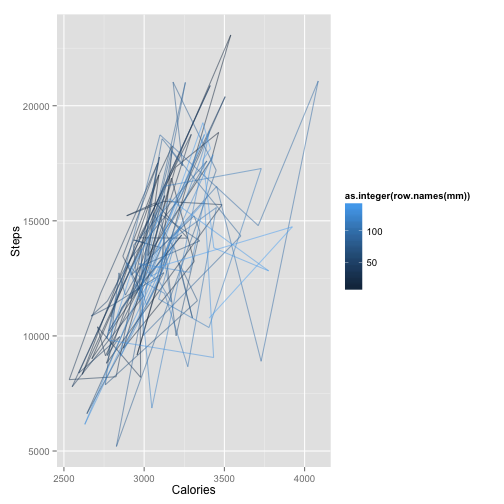 

```r
ggplot(mm, aes(Stress, MoodInt)) + geom_path(aes(colour = as.integer(row.names(mm))), 
    alpha = 0.5, na.rm = T)
```

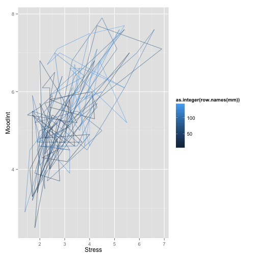 


